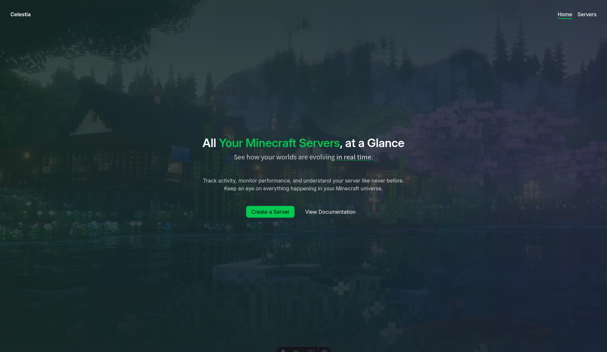
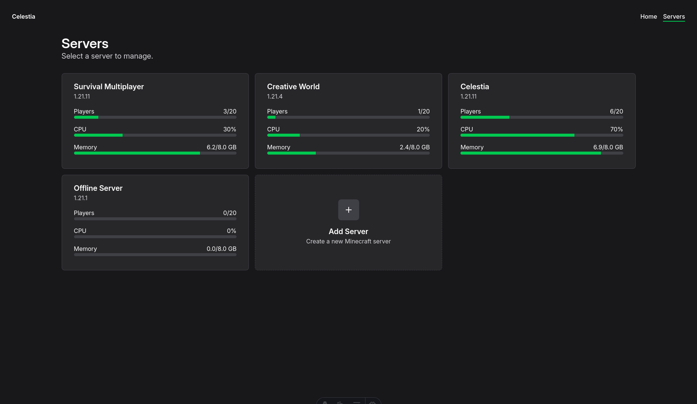

# Celestia Dashboard

This package implements the web dashboard, built with [Astro].

## Installation

Install dependencies:

```bash
npm install
```

Start the development server:

```bash
npm run dev
```

Open your browser to <http://127.0.0.1:4321>.

## Showcase





[astro]: https://astro.build/
